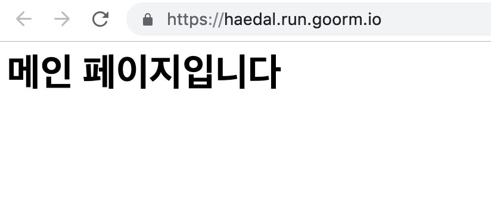
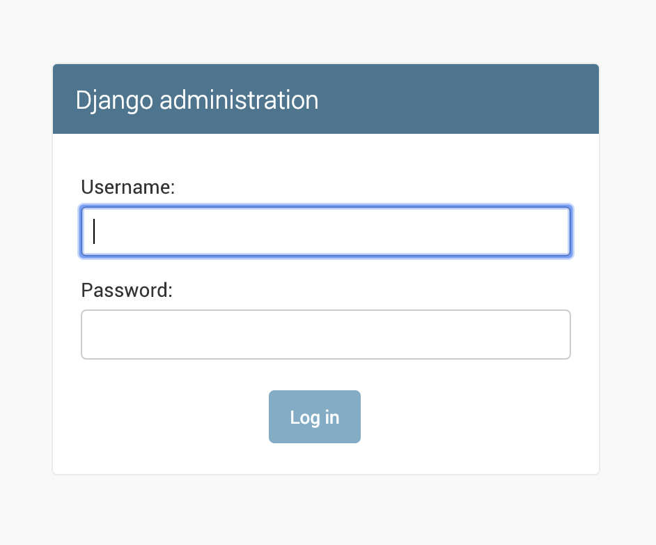
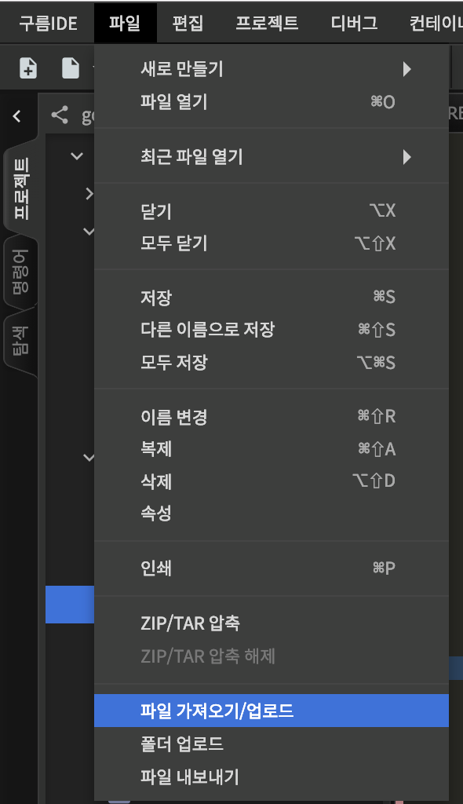
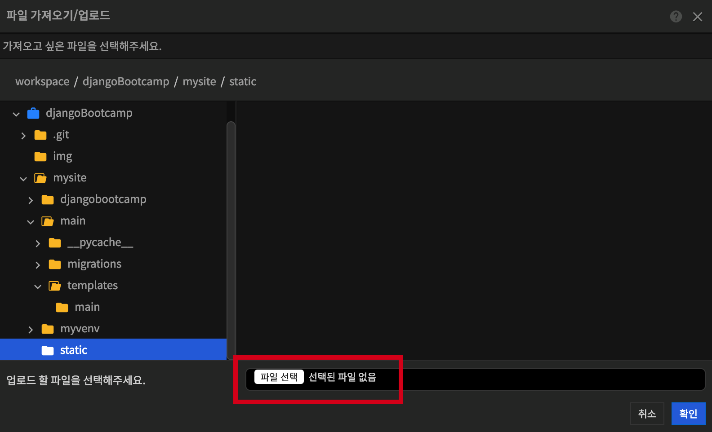
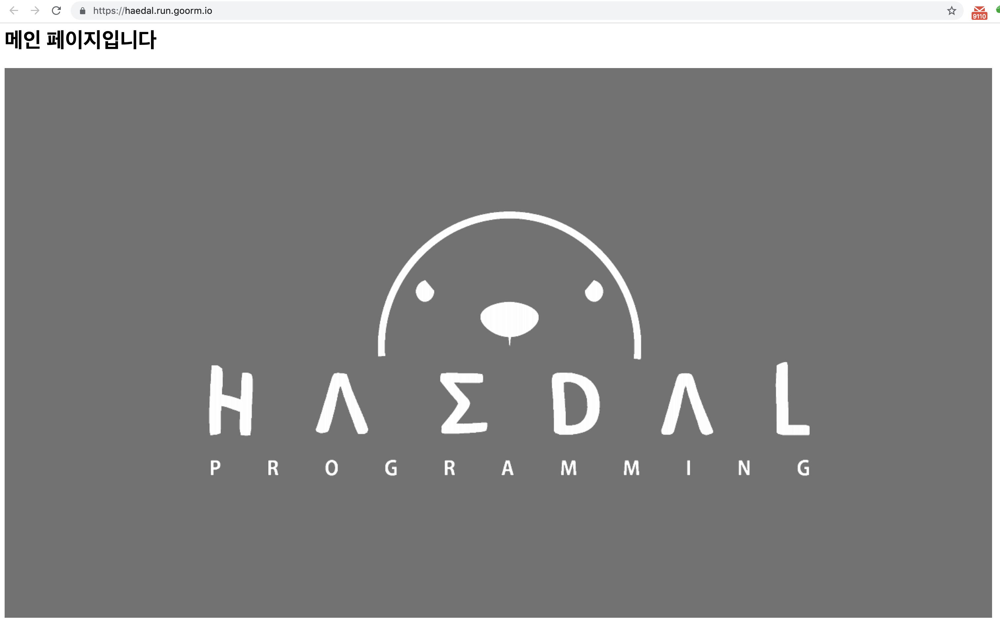

# 첫 페이지 만들기
> 웹페이지에 들어갔을때 맨 처음 보이는 페이지를 만듭니다

구름 IDE를 다시 키면 세팅해둔 가상환경이 종료되어  
설치한 장고(`django`)를 불러오지 못합니다

가상환경부터 다시 켜봅니다
```console
root@goorm:/workspace/djangoBootcamp/mysite(master)# source myvenv/bin/activate
```
가상환경이 실행되면 cmd 창에 `(myvenv)`가 추가됩니다  
아래에서 확인해봅니다
```console
(myvenv) root@goorm:/workspace/djangoBootcamp/mysite(master)#
```

이제 지난번에 개발했던 환경과 동일해졌습니다.

`djangoBootcamp`프로젝트 안에서 동작할 `main` 어플리케이션을 만들어봅니다.  
`main`어플리케이션 안에 첫 페이지를 만들겁니다.
```console
(myvenv) root@goorm:/workspace/djangoBootcamp/mysite(master)# python3 manage.py startapp main
```

장고에게 어플리케이션이 추가되었음을 알려야합니다.  
`/mysite/djangobootcamp/settings.py`파일의 33번째 줄에  
`INSTALLED_APPS` 리스트에 `main`어플리케이션을 추가됐음을 알립니다.  

`/mysite/djangobootcamp/settings.py`
```python
INSTALLED_APPS = [
    'django.contrib.admin',
    'django.contrib.auth',
    'django.contrib.contenttypes',
    'django.contrib.sessions',
    'django.contrib.messages',
    'django.contrib.staticfiles',
    # main 어플리케이션 추가
    'main',
]
```
사용자가 접속시 첫 화면을 설정하고,  
사용자가 어떤 url을 사용해 어디로 가게되는지 확인해봅시다  
이제 `/mysite/tutorialdjango/urls.py`파일을 수정합니다

`/mysite/tutorialdjango/urls.py`
```python
from django.contrib import admin
from django.urls import path
# main 어플리케이션의 view에서 index 페이지를 불러오자
from main.views import index


urlpatterns = [
    path('admin/', admin.site.urls),
    # 웹사이트의 첫화면은 index 페이지이다
    path('', index),
]
```

`/mysite/main/views.py`에서 index 함수를 만들어  
`view`가 `index.html` 페이지를 관리할 수 있게합니다.

```python
from django.shortcuts import render

# index.html 페이지를 부르는 index 함수
def index(request):
    return render(request, 'main/index.html')
```
첫 페이지로 쓸 `html` 파일을 만들어봅니다
`/mysite/main/templates/main` 디렉토리 경로에    
`index.html` 파일을 만들어봅니다

아래의 내용을 마우스로 진행하여도 무방합니다

디렉토리(폴더) 만들기 `mysite/main/templates/main`
```console
(myvenv) root@goorm:/workspace/djangoBootcamp/mysite(master)# mkdir -p main/templates/main
```

원하는 디렉토리로 이동
```console
(myvenv) root@goorm:/workspace/djangoBootcamp/mysite(master)# cd main/templates/main/
```

`mysite/main/templates/main` 디렉토리에 `index.html` 파일 만들기
```console
(myvenv) root@goorm:/workspace/djangoBootcamp/mysite/main/templates/main(master)# touch index.html
```

아래의 마크업을 `index.html` 파일에 입력합니다  
`mysite/main/templates/main/index.html`
```html
<html>
    <head>
        <title>Django Tutorial</title>
    </head>
    <body>
        <h1>메인 페이지입니다</h1>
    </body>
</html>
```

`mysite` 경로로 돌아와 서버를 켜봅니다  
웹서버가 켜지고   
접속해 아래의 그림이 뜨면 성공!
```console
(myvenv) root@goorm:/workspace/djangoBootcamp/mysite(master)# python3 manage.py runserver 0:80
```



똑똑한 장고는 관리자 페이지를 자동으로 만들어줍니다.  
관리자 페이지를 확인해봅니다   
`https://웹페이지URL/admin` url로 들어갑니다.  
아래의 화면이 나오면 성공!  



## 이미지 추가하기
대문에 걸려 수정이 없는 이미지를 추가해봅니다.  
이를 정적 이미지라고 합니다.  

`/mysite/static` 폴더를 만들고, 원하는 이미지 파일을 넣습니다.  
그 후 `/static` 폴더와 `django`를 연결시킵니다.  
이 부분이 궁금하다면 [Static 파일 호출하기 django 공식문서](https://docs.djangoproject.com/en/2.1/ref/templates/builtins/#static)


`/mysite/static` 폴더 만들기
```
(myvenv) root@goorm:/workspace/djangoBootcamp/mysite(master)# mkdir static
```
`/mysite/static` 폴더에 원하는 이미지를 한장 넣습니다  
  



django에게 정적 이미지 파일의 위치를 알려줍니다.  

`mysite/djangobootcamp/settings.py` 의 121번째 줄(마지막 부분)
```python
STATIC_URL = '/static/'
STATICFILES_DIRS = (
    # django와 static 폴더 연결
    os.path.join(BASE_DIR, 'static'),
)
```

첫 페이지에 이미지를 추가하는 html 코드를 입력합니다.

`mysite/main/templates/main/index.html`
```html
<html>
    <head>
        <title>Django Tutorial</title>
    </head>
    <body>
        <h1>메인 페이지입니다</h1>
        <!-- 정적 이미지 불러오기 -->
        
        
    </body>
</html>
```

웹서버가 켜지고   
접속해 아래의 그림이 뜨면 성공!
```console
(myvenv) root@goorm:/workspace/djangoBootcamp/mysite(master)# python3 manage.py runserver 0:80
```



#### Timezone 변경
한국 시간대로 맞춰줍니다

`/mysite/djangobootcamp/settings.py` 110번째 줄

```python
TIME_ZONE = 'Asia/Seoul'
```

## 다음 강의는
### [2B. 프론트엔드 입문](https://github.com/haedal-with-knu/djangoBootcamp/blob/master/frontEnd.md)
