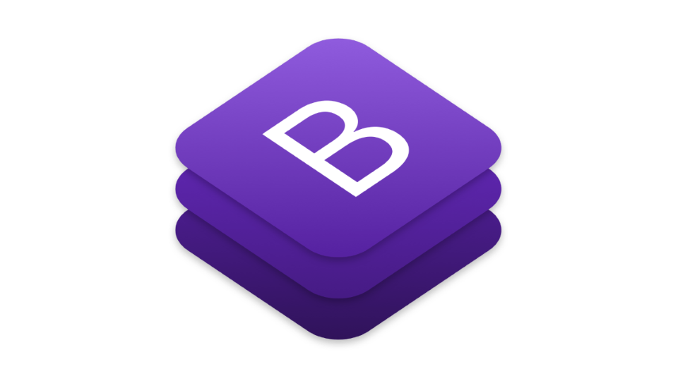
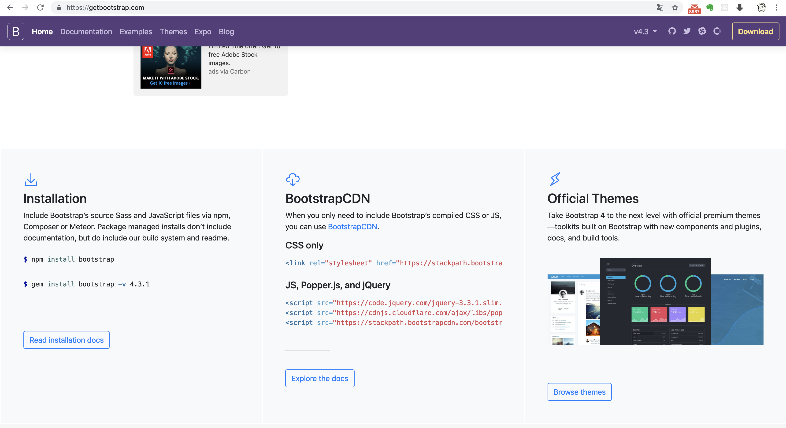
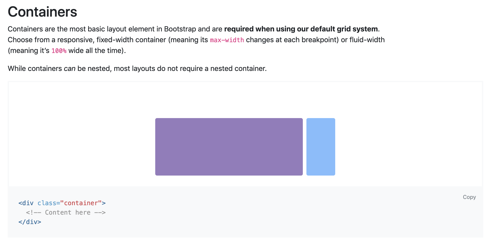
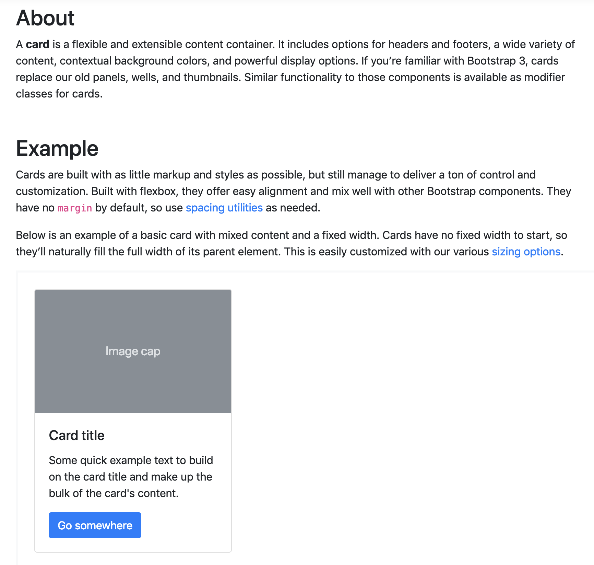

# 프론트엔드 입문

나도 이쁘게 웹페이지 만들고 싶다!  
하지만 공대생인 저에겐 힘든 여정이였습니다.

오픈소스를 설명할때 비유한 벽돌집 기억나시나요?  
벽돌부터 굽기엔 너무나 먼 여정이였습니다.  

트위터에서 만든 프론트엔드 라이브러리 [부트스트랩](https://getbootstrap.com/)을 사용해  
트위터를 닮은 웹페이지를 만들어봅니다




[HTMl에 대해 궁금하다면?](https://developer.mozilla.org/ko/docs/Learn/HTML/Introduction_to_HTML/Getting_started)  
위 문서를 읽으시면 `HTML`의 구조에 대해 이해되실 겁니다.  
파고들면 엄청난 양의 정보를 맛보실테니 필요한 것만 찾고 넘어가시면 됩니다.  
1. HTML의 전체적인 구조롤 이루는 `<html>`,`<head>`,`<body>` 태그 등
2. 내가 원하는 영역을 나누는 `<div>`,`<nav>`,`<section>` 태그 등
3. 글을 쓸 `<h1>`,`<p>` 태그 등  

이것 말고도 수많은 태그들이 있지만  
다 알고 프로그래밍하긴 불가능합니다.  
필요할 때마다 찾아 씁시다.

지난 [2A. 첫 페이지 만들기](https://github.com/haedal-with-knu/djangoBootcamp/blob/master/firstPage.md)에서 만든 페이지는 이쁘다기엔 부족합니다
`mysite/main/templates/main/index.html`
```html
<html>
<head>
    <title>Django Tutorial</title>
</head>
<body>
    <h1>메인 페이지입니다</h1>
    <!-- 정적 이미지 불러오기 -->
    
    
</body>
</html>
```

## 이쁘게 꾸며봅니다
트위터의 벽돌(`Bootstrap`)을 사용하기 위해 처음엔 `CDN`으로 시작합니다.  
`CDN`은 세계 여러 곳에 코드를 저장해둔 서버 정도로 생각합니다.  

#### `Bootstrap` `CDN`
`HTML`에서 `<head>`태그엔 중요한 정보지만   
눈에 보이지 않는 정보들이 포함됩니다.

[`Bootstrap` 홈페이지](https://getbootstrap.com/)에 가면  
`CDN`을 확인 할 수 있습니다  


`Bootstrap` `CDN`을 복사해 `<head>` 태그 안에 아래의 코드를 삽입합니다

아래와 같이 붙이면 됩니다  
`mysite/main/templates/main/index.html`
```html
<html>
    <head>
        <title>Django Tutorial</title>
        <!-- Bootstrap CDN -->
        <link rel="stylesheet" href="https://stackpath.bootstrapcdn.com/bootstrap/4.3.1/css/bootstrap.min.css" integrity="sha384-ggOyR0iXCbMQv3Xipma34MD+dH/1fQ784/j6cY/iJTQUOhcWr7x9JvoRxT2MZw1T" crossorigin="anonymous">
    </head>
    <body>
    ...
    </body>
</html>
```
### [Container](https://getbootstrap.com/docs/4.3/layout/overview/)
기술의 발달로 PC의 경우는 가로가 넓어지고, 모바일의 경우 세로가 넓어졌습니다.  
웹페이지는 기기들의 다양한 디스플레이에 탄력적으로 대응해야 했습니다.  
[반응형 웹](https://developers.google.com/web/fundamentals/design-and-ux/responsive/?hl=ko)이란 기술로 여러 기기들에 대응하게 됩니다.  
이를 가장 쉽게 이해할 수 있는 개념이 `Container`입니다.  
코드를 입력해보며 손으로 익혀봅니다.

`<body>` 태그 안의 내용을 `<div class=conatiner>`로 감싸봅니다
`mysite/main/templates/main/index.html`
```html
<html>
    <head>
        <title>Django Tutorial</title>
        <!-- Bootstrap CDN -->
        <link rel="stylesheet" href="https://stackpath.bootstrapcdn.com/bootstrap/4.3.1/css/bootstrap.min.css" integrity="sha384-ggOyR0iXCbMQv3Xipma34MD+dH/1fQ784/j6cY/iJTQUOhcWr7x9JvoRxT2MZw1T" crossorigin="anonymous">
    </head>
    <body>
        <!-- container 사용하기-->
        <div class="container">
            <h1>메인 페이지입니다</h1>
            <!-- 정적 이미지 불러오기 -->
            
                
        </div>
        
    </body>
</html>
```




### [Grid 시스템(Col, Row)](https://getbootstrap.com/docs/4.3/layout/grid/)
격자(`Grid`) 형식으로 디스플레이를 나누어 콘텐츠들을 배치하는 방식으로  
가로축을 `Col`, 세로축을 `Row`로 나타냅니다

페이스북, 인스타그램에서 많이 본 `Card`형식의 게시글들을 나타내려면  
적당한 크기의 가로로 배치하는 것이 중요합니다.
> 세로로 긴 글은 스크롤을 내리면 되니 문제가 덜 생깁니다

화면의 가로 축을 12칸으로 나누어 기기마다 대응합니다.

디스플레이 마다 대응하기엔 아직 힘드니 PC에서 진행해봅니다.
`mysite/main/templates/main/index.html`
```html
<html>
    <head>
        <title>Django Tutorial</title>
        <!-- 한국말을 사용하겠다 -->
        <meta charset="utf-8">
        <!-- 화면 너비에 맞게 페이지를 맞추겠다 -->
        <meta name="viewport" content="width=device-width, initial-scale=1, shrink-to-fit=no">
        <!-- Bootstrap CDN -->
        <link rel="stylesheet" href="https://stackpath.bootstrapcdn.com/bootstrap/4.3.1/css/bootstrap.min.css" integrity="sha384-ggOyR0iXCbMQv3Xipma34MD+dH/1fQ784/j6cY/iJTQUOhcWr7x9JvoRxT2MZw1T" crossorigin="anonymous">
    </head>
    <body>
        <!-- container 사용하기-->
        <div class="container">
            <h1>Grid 공부하기 - Col,Row</h1>
            <!-- Grid 시스템을 사용하겠다 -->
            <div class="row">
                <!-- 3칸짜리 div를 만듭니다. 파란색이고, padding은 3만큼 넣습니다 -->
                <div class="col-sm-3 bg-primary p-3">col-3</div>
                <div class="col-sm-3 bg-primary p-3">col-3</div>
                <div class="col-sm-3 bg-primary p-3">col-3</div>
                <div class="col-sm-3 bg-primary p-3">col-3</div>
                <div class="col-sm-3 bg-primary p-3">col-3</div>
                <div class="col-sm-3 bg-primary p-3">col-3</div>
                <div class="col-sm-3 bg-primary p-3">col-3</div>
            </div>
        </div>
    </body>
</html>```

`col-sm-3`을 `col-3`으로 진행해도 비슷하게 작동합니다.  
`col-sm-3`은 모바일 화면에서 1줄(12칸)을 차지합니다.(540px 미만)  
태블릿, 노트북, 데스크탑에서 3칸으로 적용됩니다(540px 이상)  
`col-3`은 모든 화면에서 3칸으로 적용됩니다.

##### 반응형 웹의 강력함이 느껴지나요?


### [Card](https://getbootstrap.com/docs/4.3/components/card/)
휴대폰, '패블릿', 태블릿, 데스크톱, 게임 콘솔, TV, 웨어러블 등 다양한 화면 크기가 존재합니다.  
화면 크기는 항상 변하기 마련이므로, 현재나 미래에 모든 화면 크기에 맞게 사이트를 만드는 것이 중요합니다.  
이에 적응한 대표적인 방식이 `Card`입니다.

`mysite/main/templates/main/index.html`
```html
<html>
    <head>
        <title>Django Tutorial</title>
        <!-- Bootstrap CDN -->
        <link rel="stylesheet" href="https://stackpath.bootstrapcdn.com/bootstrap/4.3.1/css/bootstrap.min.css" integrity="sha384-ggOyR0iXCbMQv3Xipma34MD+dH/1fQ784/j6cY/iJTQUOhcWr7x9JvoRxT2MZw1T" crossorigin="anonymous">
    </head>
    <body>
        <!-- container 사용하기-->
        <div class="container">
            <h1>Card 사용하기</h1>
            <!-- Grid 시스템을 사용하겠다 -->
            <div class="row">
                <!--첫번째 카드 : 태블릿 이상에서 4칸, 모바일에서 1줄(12칸)-->
                <div class="col-sm-4">
                    <div class="card" style="width: 18rem;">
                      <!-- 이미지는 적당한걸 넣읍시다-->
                      
                      
                      <div class="card-body">
                        <h5 class="card-title">Card title</h5>
                        <p class="card-text">Some quick example text to build on the card title and make up the bulk of the card's content.</p>
                        <a href="#" class="btn btn-primary">Go somewhere</a>
                      </div>
                    </div>
                </div>
            </div>
        </div>
    </body>
</html>
```

이제 카드가 1개 생겼습니다
확인해봅니다

카드 4개짜리도 ㄱㄱ




### [Navbar](https://getbootstrap.com/docs/4.3/components/navbar/)
많은 홈페이지에서 사용하는 상단 메뉴바를 만들어봅니다  
[`Bootstrap` Navbar](https://getbootstrap.com/docs/4.3/components/navbar/)에 들어가 적당한 Navbar을 찾아 코드를 가져와 `<body>`태그 안에 붙입니다.  

저는 아래의 코드를 가져왔습니다.  


`mysite/main/templates/main/index.html`
```html
<html>
    <head>
        <title>Django Tutorial</title>
        <link ...>
    </head>
    <body>
        <!-- 홈페이지 상단에 nav가 들어갑니다-->
        <nav class="navbar navbar-expand-lg navbar-light bg-light">
            ...
            ... 엄청 길게 들어갑니다
            ... 놀라지 마세요
        </nav>
        <div class="container">
            ...
        </div>
    </body>
</html>
```


